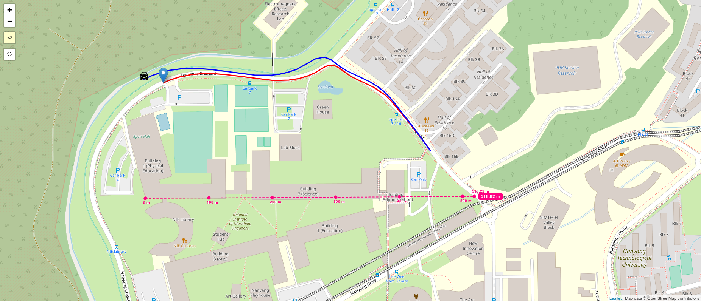

# ROS-LEAFLET-GPS

 This application is designed to display an OSM map with Leaflet in a browser, while connected to ROS, so it can display the position and trajectory of the GPS (/NavSatFix) using a marker. 
 
 This package is also able to integrate visual odometry results in geometry_msgs/PoseStamped format.

 On the left side you can see the ruler like button. You can use it to measure the metric distance. 

 

 *A screenshot of the demo program. The map marker represents GPS results and the vehicle represents the estimated pose using visual odometry.*

 **Thanks to**: 
 1) [ROS-OSM-map-integration](https://github.com/sylvainar/ROS-OSM-map-integration) for providing the ROS interface.
 2) [Leaflet PolyLine Measurement Plugin](https://github.com/ppete2/Leaflet.PolylineMeasure) for providing the measurement plugin.

## Installation 

This is not actually a ROS package, so you do not need to put it in catkin workspace. It connects to ROS to get information from GPS sensor, and uses some ROS functionality, for instance ROS param, ROS topic, etc. 

To allow this application to connect with ROS, you need to install RosBridge, which is kind of a bridge to connect some Javascript apps to the ROS core. To do so, please follow the [tutorial](http://wiki.ros.org/rosbridge_suite/Tutorials/RunningRosbridge).

Simply type:
```
 sudo apt install ROS-<ROS-VERSION>-rosbridge-suite
```

In order to launch rosbridge with the rest of your stuff, you can add this to your launch file :
```
    <launch>
        <include file="$(find rosbridge_server)/launch/rosbridge_websocket.launch" > 
            <arg name="port" value="9090"/>
        </include>
    </launch>
```

And then, open the page `index.html` with your favorite browser, and you're ready. You can even set the default page of your browser to it, so it opens automatically on startup.

## Structure

```bash
    .
    ├── assets                  # Pictures and icons.
    ├── launch                  # Demo launch files
    ├── lib                     # All important js libraries, including leaflet, leaflet plugins, three 3D lib.
    ├── index.html              # Demo html page for displaying the map.
    ├── script_pose.js          # Demo js script to display `geometry_msgs/PoseStampedWithCovariance` message.
    ├── script_fix.js           # Demo js script to display `NavSatFix` for GPS 
                                # and `rds_msgs/msg_novatel_bestpos` for self defined pose.
    ├── script_reuse_path.js    # Demo js script to display `PoseStampedWithCovariance` message
                                # for GPS and `nav_msgs/Path` for self defined pose.
    └── README.md
```

## Demo

You can download the [ROS bag](https://entuedu-my.sharepoint.com/:u:/g/personal/hzhang032_e_ntu_edu_sg/EYs9Lee1Q5VDgj81AEtWXdsBkxulwHRkOkeT5C-y9p9hOg?e=68Npx2) to directly try the demo. In order to make the two trajectories generated by SLAM and GPS discriminative, I intented to make the SLAM not so accurate.

This ROS bag contains GPS pose (`/gps_pose`), SLAM pose (`/sslam_estimator_node/camera_pose`) and SLAM path (`/pose_graph_path`). For the full bag containing image information, please download the link [here](https://entuedu-my.sharepoint.com/:u:/g/personal/hzhang032_e_ntu_edu_sg/ES5ev4QdrPJOiafMX2KJntYBfEjwDSEZp25AlAHJSt-MuQ?e=Pto0xB).


#### Configuration

The configuration of the module can be modified just by changing the value at the top of the script.js file.

 - `CONFIG_tile_source` : Set the source of the tiles for the map. If you downloaded the maps of the area you want to move in, then you can set it to `local`. Else, set it to `server`.
 - `CONFIG_tile_local_path` : Path to the downloaded tiles
 - `CONFIG_ROS_server_URI` : Route to ROS server. It could be localhost or an IP.

#### Parameters

In the lab, we're working with two different GPS, which are not publishing on the same topic and at the same frequency. So two parameters can be set : 

- `/panel/gps_topic` for the GPS topic's name. Example : `/gps`
- `/panel/pose_topic` for the VO topic's name. Example : `/slam/pose`
- `/panel/nb_cycles` for the number of cycles between each refreshing. Example : `20`

You can set those in a ROS launch file, or set it using `rosparam set`, then refreshing the page in the browser by clicking on the refresh button.


#### Example 1


 1) Run `roslaunch ./launch/novatel_pose.launch`

 3) Open *index_pose.html* with a browser

 4) Play demo ROS bag file

This will display GPS (`geometry_msgs/PoseStampedWithCovariance`) in red trajectory and estimated pose (`geometry_msgs/PoseStampedWithCovariance`) in blue trajectory.


#### Example 2


 1) Run `roslaunch ./launch/novatel_path.launch`

 3) Open *index_path.html* with a browser

 4) Play demo ROS bag file

This will display GPS (`geometry_msgs/PoseStampedWithCovariance`) in red trajectory and estimated pose (`nav_msgs/Path`) in blue trajectory.


The advantage of `nav_msgs/Path` over `geometry_msgs/PoseStampedWithCovariance` is that it is not fixed. Pose graph optimization and loop closure might update your SLAM trajectory. The `novatel_path` is able to update the drawn path of your estimated pose.
